# 🛡️ Decopia – Web Behavioral Deception Platform (Frontend)

> A lightweight web-based deception dashboard designed to empower SMEs with early-stage cyber threat detection and behavioral attack analysis.

---

## 📌 Overview

**Decopia** is a web-based deception management system built to support SMEs in detecting and analyzing web-layer attacks through behavioral honeypots.

The system provides **role-based interfaces** tailored for different stakeholders inside the organization (Admin, Pen Tester, SOC, Security Engineer, etc.), allowing each role to interact with the deception platform according to their responsibilities.

This repository contains the **Frontend application**, built with **React** and deployed on **Vercel**, connected to a **.NET backend API**.

---

## 🎯 Project Goal

Small and medium-sized enterprises (SMEs) often lack access to advanced cybersecurity tools due to limited budgets and expertise.

**Decopia addresses this gap by:**

- Providing a lightweight deception interface
- Supporting early detection of malicious payloads
- Enabling behavioral evaluation of detection & classification accuracy
- Offering structured role-based dashboards

---

## 🧱 Architecture (High-Level)
Decoy Creation → Traffic Logger → Alerting → SIEM Integration → Dashboard Visualization

This frontend focuses on:

- Role-based dashboard visualization
- Payload testing & evaluation interface
- Administrative management system
- Data analytics and reporting

---

## 👥 System Roles

The system is designed with separated interfaces per role:

- Admin
- Pen Tester
- Customer
- Security Engineer
- SOC Analyst
- Frontend
- Backend

Each role has isolated routing and protected access.

---


# ✅ Implemented Features 

---

## 🔐 Routing & Security

- Protected routes using custom `ProtectedRoute`
- Role-based access control
- Authentication-aware navigation
- Route isolation per role

---

## 🧑‍💼 Admin Interface

Admin has access to 2 main pages:

### 1️⃣ Dashboard
- System activity summary
- Visual insights using charts
- High-level system overview


### 2️⃣ User Management
- Add new users
- Assign roles
- Edit existing users
- Delete users
- Search users
- Filter users by role


3️⃣ Customer Management
- Add new customers
- View all customers
- Edit customer information
- Delete customers
- Search customers
- View customer details

---

## 🧑‍💻 Pen Tester Interface

Pen Tester has access to:

### 1️⃣ Payload Reports
- Table of attacks
- Number of payloads per attack
- Detection error percentage
- Classification error percentage
- Detailed view of failed detections/classifications

### 2️⃣ Test Payload Page
- Input field for custom payload
- Results displayed as cards
- Each card includes:
  - Attack name
  - Score
- Manual evaluation for:
  - Detection accuracy
  - Classification accuracy
- Notes field per evaluation


---

## 🛡️ Security Engineer Interface 

Security Engineer has access to:

### 1️⃣ Payload Reports
- Table of attacks
- Number of payloads per attack
- Detection error percentage
- Classification error percentage
- Detailed failed detections and classifications

### 2️⃣ Rules Management

Upload detection and classification rule files to the backend engine.

#### Features:

- Upload rule files
- Categorize rules
- View uploaded files
- Download uploaded files
- Track file metadata


---

## ⚙️ Backend Interface

Backend team has access to:

### 1️⃣ Rules Repository

View all rule files uploaded by Security Engineers.

#### Features:

- View uploaded rule files
- Download files
- View file metadata


### Upload and manage API documentation or integration files intended for the Frontend team.

#### Features:

- Upload API files
- View uploaded APIs
- Download API files
- Track uploaded versions

---

## 🎨 Frontend Interface

Frontend team has access to:

### 1️⃣ API Repository

View and download API files uploaded by the Backend team.

#### Features:

- View available APIs
- Download API files
- Track latest API updates

--- 

## 📡 SOC Analyst Interface

SOC Analysts have access to:

### 1️⃣ SIEM Integration Reports

Upload weekly reports generated from SIEM integrations.

#### Features:

- Upload weekly reports
- Manage historical reports
- Download previous reports
- Track reporting activity

--- 
## 👤 Customer Interface

Customers have access to 2 main pages:

### 1️⃣ Security Dashboard

#### Overview cards displaying:

- Total Logs
- Critical Alerts
- Medium Alerts
- Total Attack Events
- Logs Table

#### Displayed information:

Level	Attack Type	Source IP	Decoy	Payload	New Attack	Time

##### Features:

- View attack logs
- Monitor security events
- Review SIEM reports uploaded by SOC team
### 2️⃣ Account Information

#### Customer profile details:

- Customer Name
- Email Address
- Company Information
- Subscription Details
- Assigned Decoys

---


## Screenshots 🖼️


### Login


###  Admin Dashboard
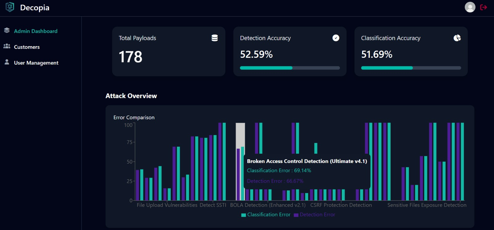
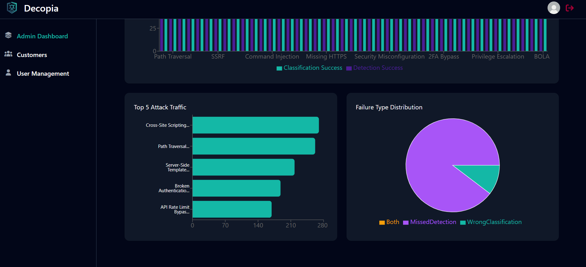

###  User Management
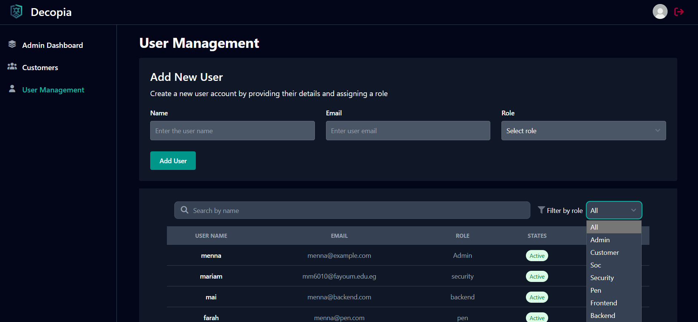

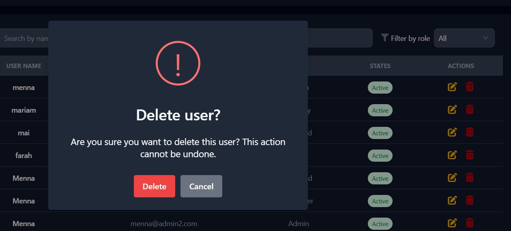


### customer Management
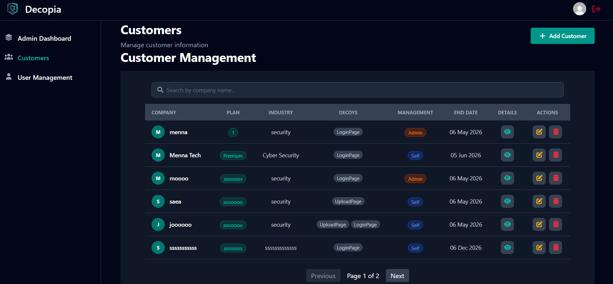
#### Add customer 
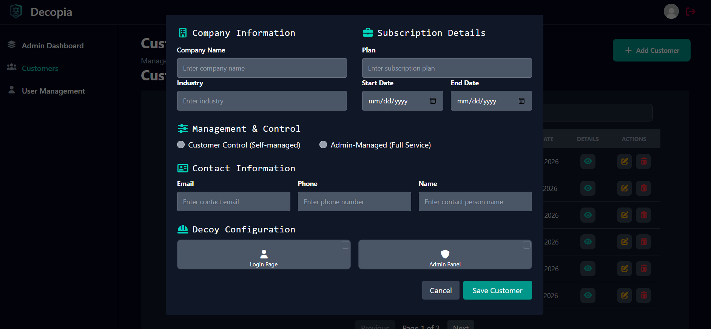
#### customer details
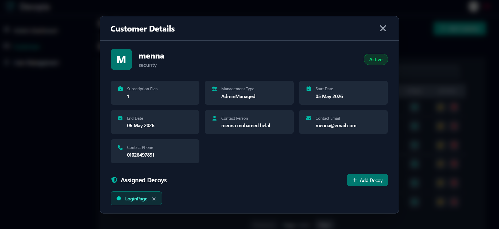
#### update customer 
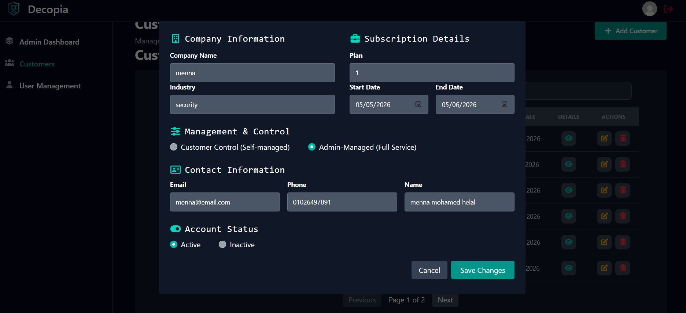
#### delete customer 
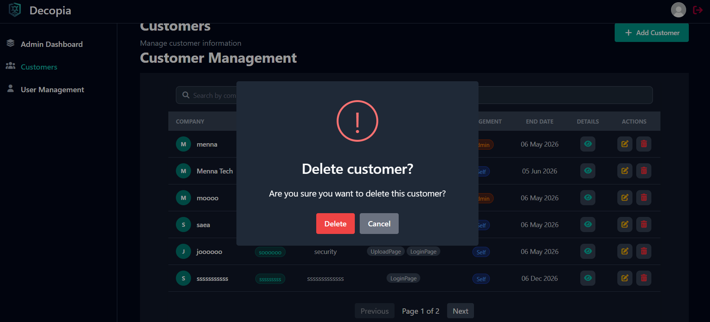


###  Penetration Testing interfaces
#### Penetration Testing Reports

####  Test Payload Interface
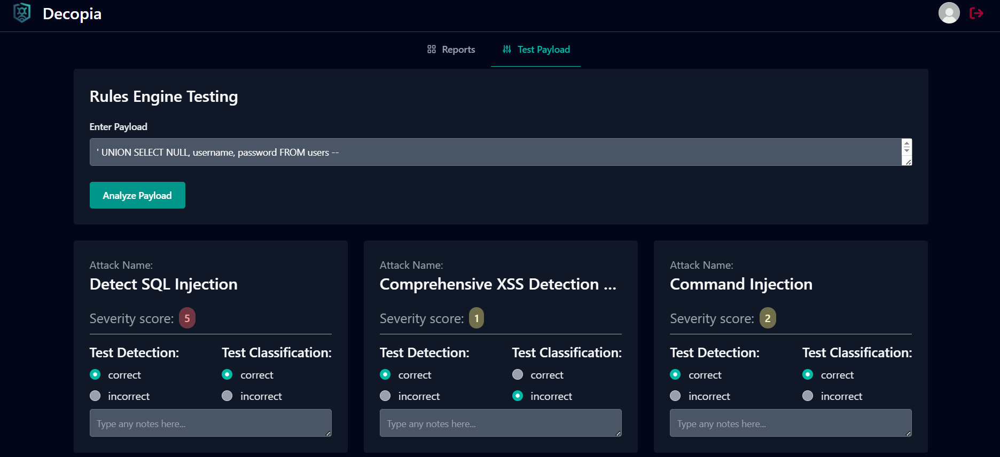

### Backend interfaces
#### Upload API Documentation
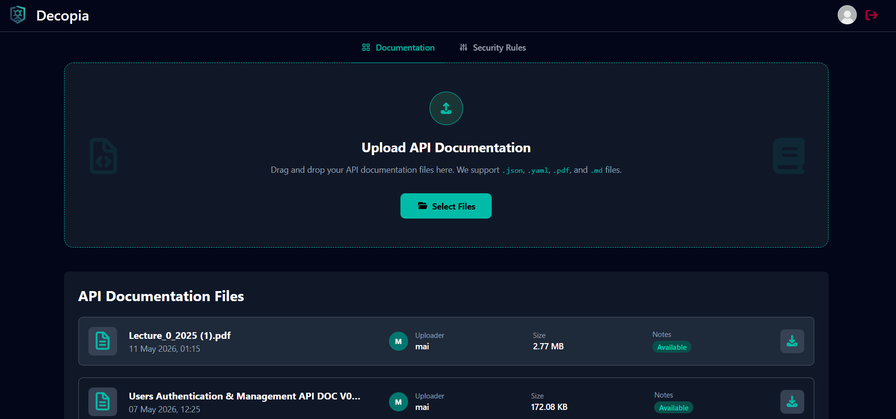
#### rules repository
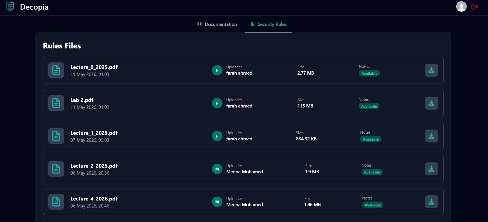


### frontend interfaces
#### API Documentation repository
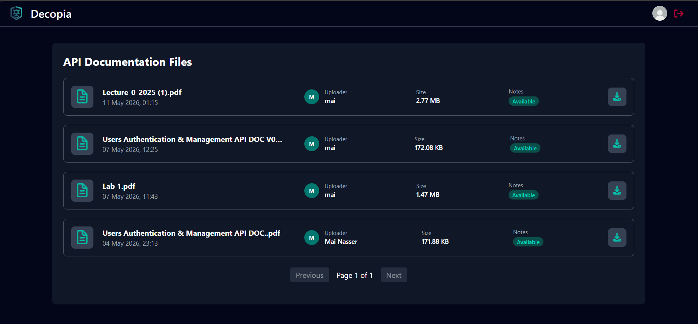

### security interfaces 
#### security report
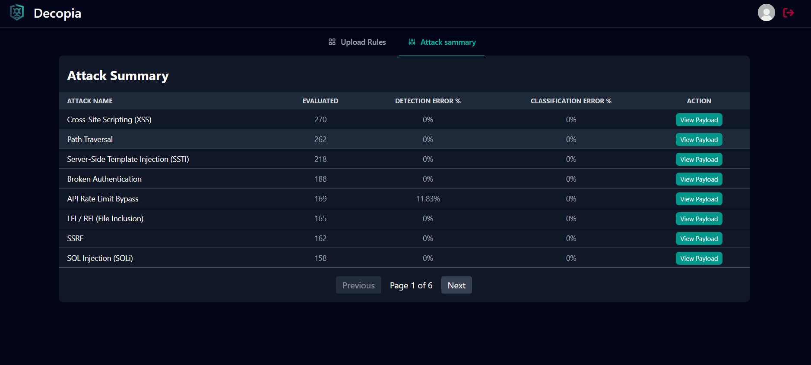
#### upload rules
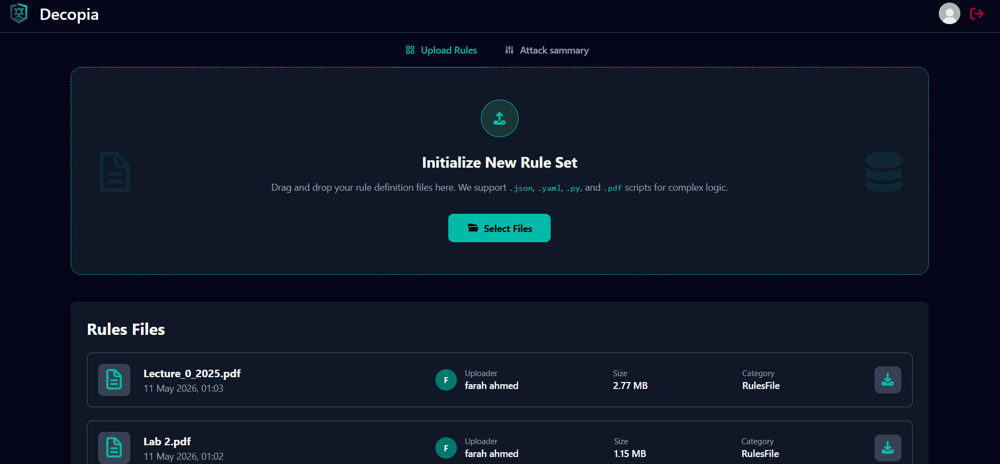


### Customer dashboard
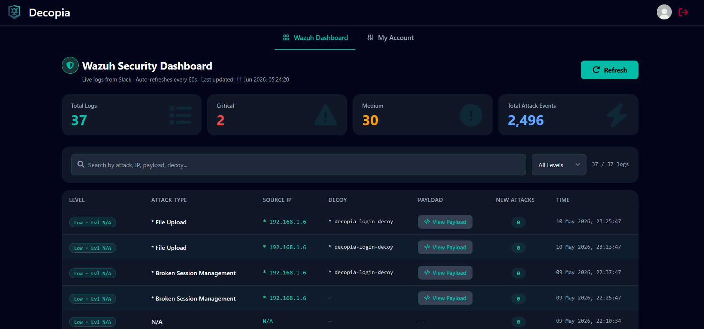
### customer account
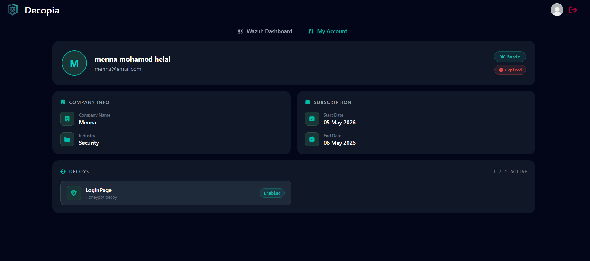


---

# 🛠️ Tech Stack

## 🎨 Frontend

- React 19
- Vite
- React Router DOM
- Tailwind CSS
- Flowbite
- Axios
- React Query (@tanstack/react-query)
- Chart.js + react-chartjs-2
- React Hook Form + Zod
- SweetAlert2
- React Spinners
- FontAwesome
- tsparticles

---

## 🔌 Backend (External API)

- .NET Web API  
  https://pen-testing-rules-engine.runasp.net/api
  https://decopia-management-system.runasp.net/api

---

## 🚀 Deployment

- Deployed on **Vercel**
  https://decopia.vercel.app/

---

# 🎨 UI Theme

**Primary Colors:**

- `slate-950` → Dark base
- `teal-400` → Accent color

The UI follows a **dark cybersecurity-oriented theme** inspired by SOC dashboards to provide a professional monitoring experience.

---

# 📂 Project Structure
[Structure-tree](./Structure-tree.md)

---

# 🚀 Getting Started

## Clone the Repository

```bash
git clone https://github.com/mennamohamed-60/Decopia.git
cd decopia
```

### 📦 Install dependencies:
```bash
npm install
```

### 🚀 Run the development server:
```bash
npm run dev
```

### 🌐 Open in browser:
http://localhost:5173


