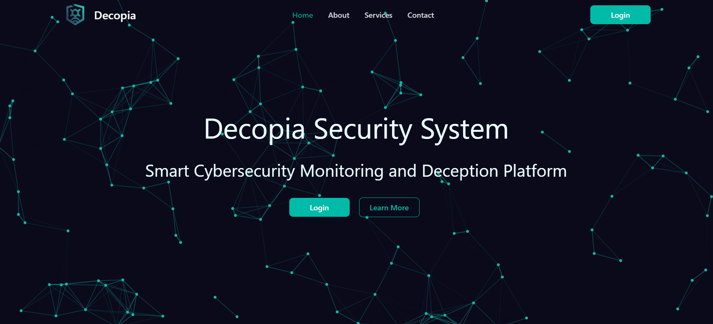
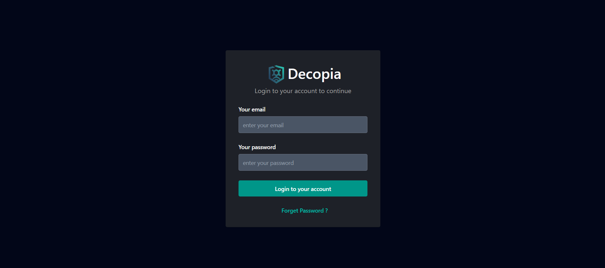
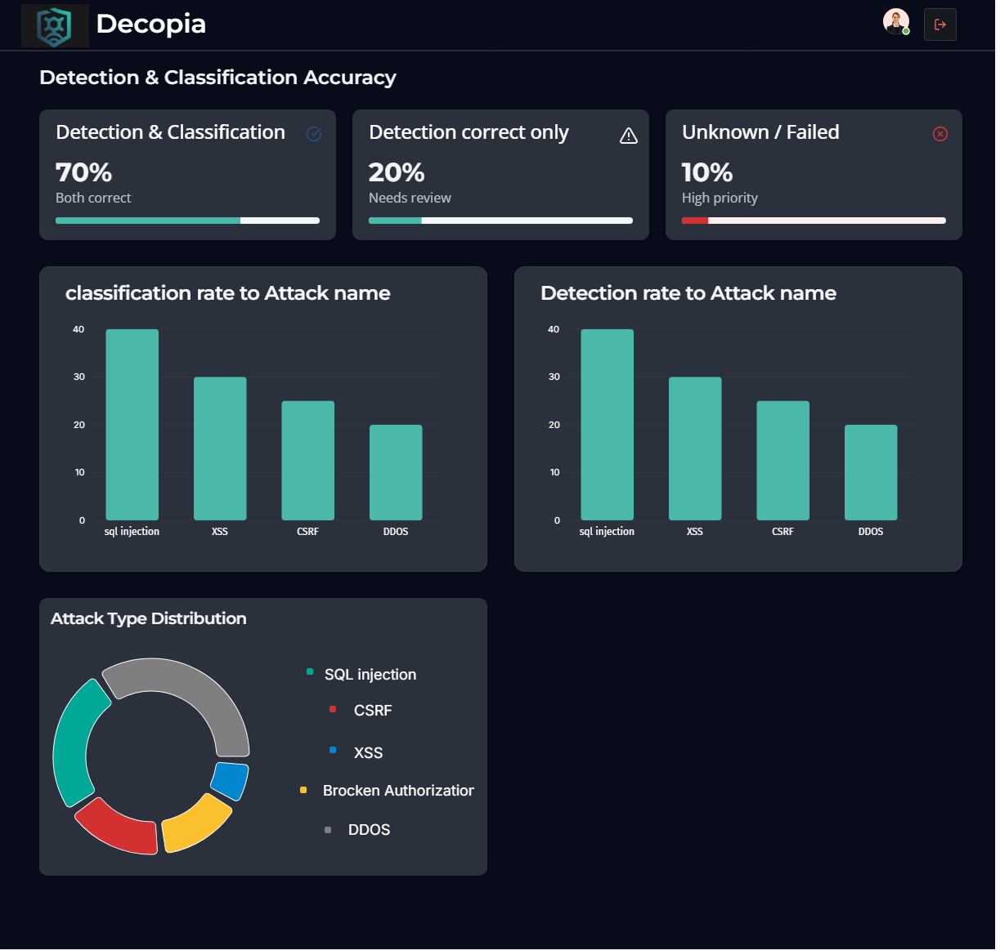
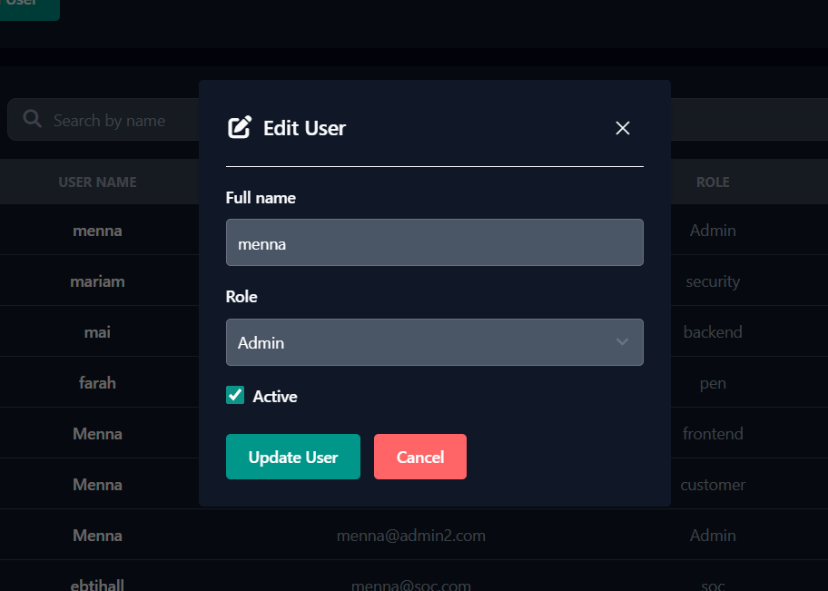
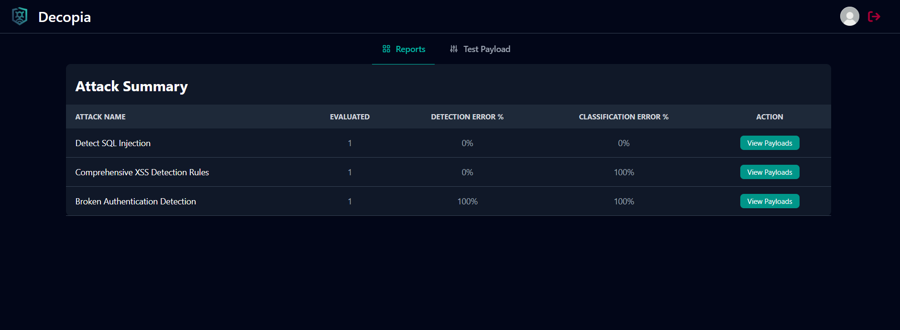

# 🛡️ Decopia – Web Behavioral Deception Platform (Frontend)

> A lightweight web-based deception dashboard designed to empower SMEs with early-stage cyber threat detection and behavioral attack analysis.

---

## 📌 Overview

**Decopia** is a web-based deception management system built to support SMEs in detecting and analyzing web-layer attacks through behavioral honeypots.

The system provides **role-based interfaces** tailored for different stakeholders inside the organization (Admin, Pen Tester, SOC, Security Engineer, etc.), allowing each role to interact with the deception platform according to their responsibilities.

This repository contains the **Frontend application**, built with **React** and deployed on **Vercel**, connected to a **.NET backend API**.

---

## 🎯 Project Goal

Small and medium-sized enterprises (SMEs) often lack access to advanced cybersecurity tools due to limited budgets and expertise.

**Decopia addresses this gap by:**

- Providing a lightweight deception interface
- Supporting early detection of malicious payloads
- Enabling behavioral evaluation of detection & classification accuracy
- Offering structured role-based dashboards

---

## 🧱 Architecture (High-Level)
Decoy Creation → Traffic Logger → Alerting → SIEM Integration → Dashboard Visualization

This frontend focuses on:

- Role-based dashboard visualization
- Payload testing & evaluation interface
- Administrative management system
- Data analytics and reporting

---

## 👥 System Roles

The system is designed with separated interfaces per role:

- Admin
- Pen Tester
- Customer
- Security Engineer
- SOC Analyst
- Frontend
- Backend

Each role has isolated routing and protected access.

---

# 🚀 Current Prototype Status

The current version includes a fully functional **role-based dashboard system** with working:

- Authentication & route protection
- Admin management modules
- Payload testing & evaluation interface
- Detection & classification reporting views

---

# ✅ Implemented Features (Current Version)

---

## 🔐 Routing & Security

- Protected routes using custom `ProtectedRoute`
- Role-based access control
- Authentication-aware navigation
- Route isolation per role

---

## 🧑‍💼 Admin Interface

Admin has access to 2 main pages:

### 1️⃣ Dashboard
- System activity summary
- Visual insights using charts
- High-level system overview


### 2️⃣ User Management
- Add new users
- Assign roles
- Edit existing users
- Delete users
- Search users
- Filter users by role

---

## 🧑‍💻 Pen Tester Interface

Pen Tester has access to:

### 1️⃣ Payload Reports
- Table of attacks
- Number of payloads per attack
- Detection error percentage
- Classification error percentage
- Detailed view of failed detections/classifications

### 2️⃣ Test Payload Page
- Input field for custom payload
- Results displayed as cards
- Each card includes:
  - Attack name
  - Score
- Manual evaluation for:
  - Detection accuracy
  - Classification accuracy
- Notes field per evaluation


## Screenshots 🖼️
### Home page


### Login


### 🧑‍💼 Admin Dashboard


### 👤 User Management





### 📊 Penetration Testing Reports


### 🧪 Test Payload Interface

---

# 🛠️ Tech Stack

## 🎨 Frontend

- React 19
- Vite
- React Router DOM
- Tailwind CSS
- Flowbite
- Axios
- React Query (@tanstack/react-query)
- Chart.js + react-chartjs-2
- React Hook Form + Zod
- SweetAlert2
- React Spinners
- FontAwesome
- tsparticles

---

## 🔌 Backend (External API)

- .NET Web API  
  https://pen-testing-rules-engine.runasp.net/api
  https://decopia-management-system.runasp.net/api

---

## 🚀 Deployment

- Deployed on **Vercel**
  https://decopia.vercel.app/

---

# 🎨 UI Theme

**Primary Colors:**

- `slate-950` → Dark base
- `teal-400` → Accent color

The UI follows a **dark cybersecurity-oriented theme** inspired by SOC dashboards to provide a professional monitoring experience.

---

# 📂 Project Structure
```plaintext
Project Root
├── public/
├── src/
│   ├── assets/
│   ├── Charts/
│   ├── Components/
│   │   ├── Admin/
│   │   │   └── Admin.jsx
│   │   ├── AdminInterfaces/
│   │   │   ├── AdminBack/
│   │   │   │   └── AdminBack.jsx
│   │   │   ├── AdminCustomer/
│   │   │   │   └── AdminCustomer.jsx
│   │   │   ├── AdminFront/
│   │   │   │   └── AdminFront.jsx
│   │   │   ├── AdminPen/
│   │   │   │   └── AdminPen.jsx
│   │   │   ├── AdminSecurity/
│   │   │   │   └── AdminSecurity.jsx
│   │   │   ├── AdminSoc/
│   │   │   │   └── AdminSoc.jsx
│   │   │   └── AdminStart/
│   │   │       └── AdminStart.jsx
│   │   ├── AnimationBG/
│   │   │   ├── AnimationBG.jsx
│   │   │   └── animationBg.css
│   │   ├── AuthRoute/
│   │   │   └── AuthRoute.jsx
│   │   ├── Back/
│   │   │   └── Back.jsx
│   │   ├── Customer/
│   │   │   └── Customer.jsx
│   │   ├── Error/
│   │   │   └── Error.jsx
│   │   ├── Front/
│   │   │   └── Front.jsx
│   │   ├── Home/
│   │   │   └── Home.jsx
│   │   ├── HomeNavbar/
│   │   │   └── HomeNavbar.jsx
│   │   ├── Layout/
│   │   │   └── Layout.jsx
│   │   ├── Login/
│   │   │   └── Login.jsx
│   │   ├── LogoutButton/
│   │   │   └── LogoutButton.jsx
│   │   ├── MainNavbar/
│   │   │   └── MainNavbar.jsx
│   │   ├── Pen/
│   │   │   ├── PenReports/
│   │   │   │   ├── ReportPayloads/
│   │   │   │   │   └── ReportPayloads.jsx
│   │   │   │   ├── PenReports.jsx
│   │   │   │   └── ReportLoading.jsx
│   │   │   ├── TestPayload/
│   │   │   │   ├── PayloadCard.jsx
│   │   │   │   ├── PayloadForm.jsx
│   │   │   │   ├── TestLoading.jsx
│   │   │   │   └── TestPayload.jsx
│   │   │   └── Pen.jsx
│   │   ├── ProtectedRoute/
│   │   │   └── ProtectedRoute.jsx
│   │   ├── Security/
│   │   │   └── Security.jsx
│   │   ├── Soc/
│   │   │   └── Soc.jsx
│   │   ├── Threat/
│   │   │   └── Threat.jsx
│   │   └── UserManagement/
│   │       ├── AddUser/
│   │       │   └── AddUser.jsx
│   │       ├── EditUserModal/
│   │       │   └── EditUserModal.jsx
│   │       ├── RoleFilter/
│   │       │   └── RoleFilter.jsx
│   │       ├── SearchInput/
│   │       │   └── (SearchInput files)
│   │       └── UserManagement.jsx
│   ├── App.css
│   ├── App.jsx
│   ├── index.css
│   └── main.jsx
├── .gitignore
├── eslint.config.js
├── index.html
├── package.json
├── package-lock.json
├── README.md
├── tailwind.config.js
├── vercel.json
└── vite.config.js

```
The structure is modular and role-oriented to maintain scalability and clarity.

---

# 🚀 Getting Started

## Clone the Repository

```bash
git clone https://github.com/mennamohamed-60/Decopia.git
cd decopia
```

### 📦 Install dependencies:
```bash
npm install
```

### 🚀 Run the development server:
```bash
npm run dev
```

### 🌐 Open in browser:
http://localhost:5173


